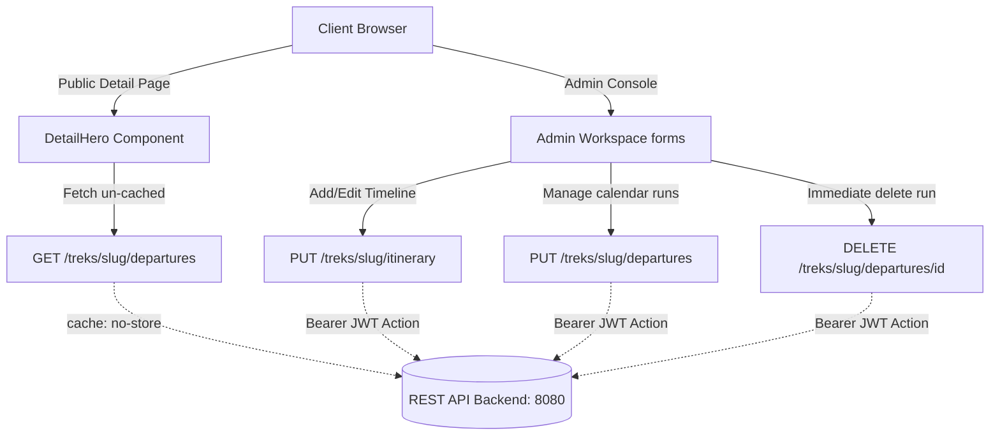

# Altis Summits — Premium Expedition & Booking Ledger

Altis Summits is a state-of-the-art, high-end trekking booking and catalog management platform. Engineered for elite mountaineering operators, it features interactive contour maps, real-time repeatable timeline milestone managers, and dynamic status-aware departure schedulers.

The frontend is constructed using **Next.js 15 (App Router)**, **React 19**, **TypeScript**, and a customized, ultra-premium **glassmorphic design system** with vibrant neon cyan focus borders, smooth micro-animations, and clean HSL dark modes.

---

## 🗺️ Architectural Ecosystem



---

## 🌟 Premium Features

### 1. Start Location / Trailhead GPS Mapper
* **Unified Layout**: Fully integrated coordinates panels sitting directly under the Leaflet Radar Map.
* **Bidirectional Map Synchronization**: 
  - Clicking on the contour map drops a pin and instantly populates latitude and longitude fields with 6 decimal places.
  - Manually typing coordinates in the text boxes immediately focuses the Leaflet map and repositions the marker pin.
* **Smart Number Input**: Replaced buggy browser number fields with regex-validated text inputs (`inputMode="decimal"`), ensuring progressive typing of negative coordinates (`-`) and decimals (`28.`) is smooth and error-free.
* **Region Flexbox**: Swapped fixed dropdown selectors for an open, flexible region text box, enabling admins to type custom regions freely (e.g. `"Karakoram Range"`, `"Nepal Himalaya"`).

### 2. Route Timeline Workspace (`ItinerariesForm.tsx`)
* **Double-Column Console**: Sleek control panel on the left (showing trek regions, status, milestone count, row triggers) and a scrollable card canvas on the right.
* **Repeatable Timeline Cards**: Milestones rendered chronologically with vertical visual dashed connector lines.
* **Inline Configurations**: Configures **Day Number**, **Milestone Title**, **Altitude/Elevation**, **Stay Type** (Teahouse, Lodge, Lodge Guesthouse, Hotel, Camp, Mountain Hut), and **Tactical Guidance**. Includes easy localized trash buttons to prune specific rows.
* **Strict Validation**: Real-time validation checks for positive day numbers, required titles, non-negative altitudes, and unique day number checking (duplicate checks render live alert summaries).

### 3. Departure Calendar Schedulers (`DeparturesForm.tsx`)
* **Double-Column Ledger**: Select trek targets to view available dates, active seats, and schedule statuses instantly.
* **HTML5 Native Date Calendars**: Harnesses native date fields to guarantee correct `YYYY-MM-DD` formatting, avoiding browser input bugs.
* **Active Status Lifecycles**: Supports scheduling enums: `SCHEDULED`, `IN_PROGRESS`, `COMPLETED`, `CANCELLED`.
* **Seat Capacity Metrics**: Allocates **Total Seats** and **Available Bookable Seats** with limits logic validation (`Available Seats <= Total Seats` and `Total Seats > 0`).
* **Immediate Server Sync**: Localized card deletions trigger immediate background server `DELETE` requests if the run already exists in the database. Unsaved draft cards are pruned from local state in-memory.

### 4. Public Trek Details Page Date Schedulers
* **Dynamic, Un-cached Endpoint Fetching**: Queries the REST backend by trek slug (`GET /api/v1/treks/{slug}/departures`) using `cache: 'no-store'` to ensure public bookers always see real-time available date lists and seat allocations without stale caching.
* **Timezone-Safe Render**: Leverages local timezone date parsing to eliminate browser UTC offset shifts that previously caused calendar dates to display a day early on user devices.
* **Status-Aware Pill Badges**: Available dates display state-coded visual pills matching the expedition phase:
  - **`SCHEDULED` with available seats**: Shows capacity (e.g. `12 Left` in cyan).
  - **`SCHEDULED` sold out**: Shows `Full` in red.
  - **`CANCELLED`**: Shows `Cancelled` in red.
  - **`COMPLETED`**: Shows `Completed` in zinc.
  - **`IN_PROGRESS`**: Shows `In Progress` in amber.
  - Unavailable cards are automatically disabled and unselectable.

---

## 🛠️ Tech Stack & Dependencies

* **Framework**: Next.js 15.1.0 (App Router)
* **Core Logic**: React 19.0.0, TypeScript 5
* **Animations**: Motion React
* **Mapping**: Leaflet 1.9.4 & React-Leaflet 4.2.1
* **Icons**: Lucide React
* **Styling**: Tailwind CSS & Vanilla CSS glassmorphic overrides
* **Security & Tokens**: Next.js secure server actions reading the HTTP-Only cookie `token` and injecting it as a JWT Bearer header to secure all backend mutation endpoints.

---

## ⚙️ Environment Configuration

Create a `.env.local` file at the root of the `frontend` folder:

```env
# REST API Backend Service URL
NEXT_PUBLIC_API_URL=http://localhost:8080
```

---

## 🚀 Getting Started

### 1. Install Dependencies
```bash
npm install
```

### 2. Run in Development Mode
```bash
npm run dev
```
Open [http://localhost:3000](http://localhost:3000) to view the application.

### 3. Verify Codebase Compilation
Verify TypeScript compiles cleanly without any strict-mode compiler issues:
```bash
npx tsc --noEmit
```

### 4. Build Production Bundle
Build a clean Next.js static and SSR distribution bundle:
```bash
npm run build
```

---

## 📂 Codebase Directory

```
src/
├── app/                  # Next.js App Router Pages
│   ├── (admin)/          # Admin Dashboard Layouts & Console Pages
│   ├── treks/            # Public Expeditions Lists & Details
│   └── page.tsx          # Public Landing View
├── actions/              # Secure Next.js "use server" Actions
│   ├── auth.ts           # Client Sign-in & Bookings MUT actions
│   └── admin.ts          # Trek, Itinerary, & Departures MUT Actions
├── components/           # Reusable Client & Layout Components
│   ├── admin/            # Admin Forms, Mappers & Chrono timelines
│   ├── ui/               # Core design buttons, inputs, & alerts
│   └── DetailHero.tsx    # Public Trek details CTA block
├── lib/                  # Application Utilities & System contracts
│   ├── types.ts          # Type Interfaces & Formatting Helpers
│   └── utils.ts          # Tailwind styling merge hook
```
